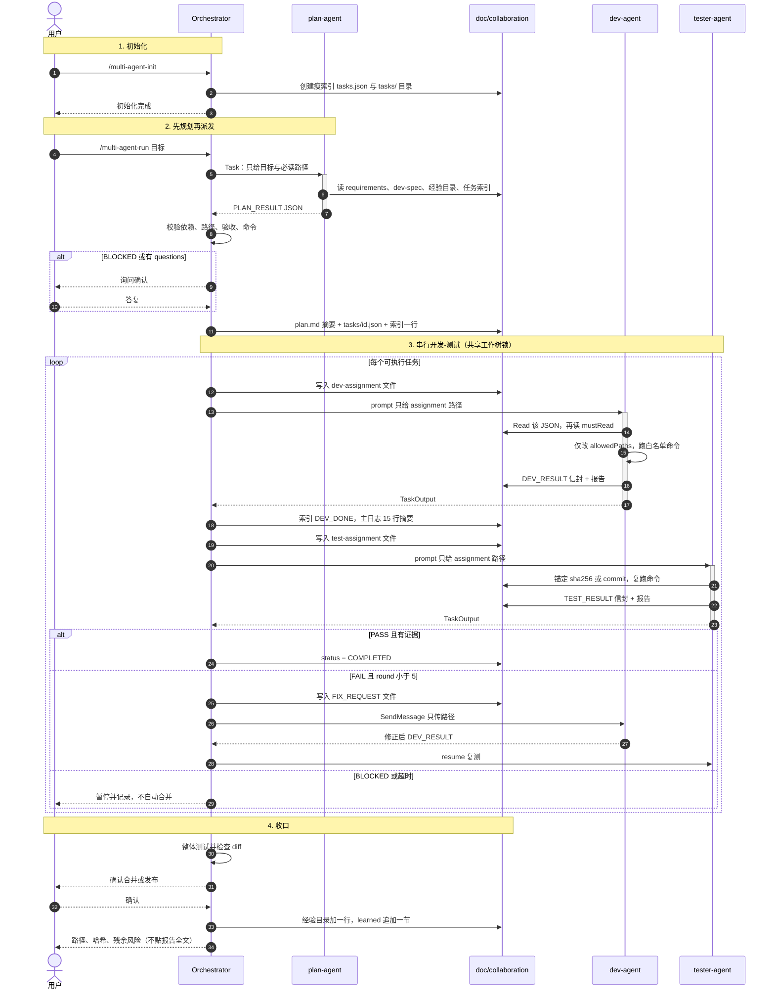
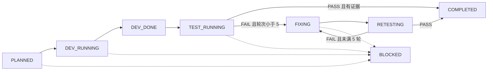

# Claude Code 多 Agent 协作模式（v2）

给人看的说明。可安装的协议、Agent、斜杠命令在 [`protocol/`](protocol/)。

**v2 只改一件事：证据继续厚厚落盘；每次进模型的只是当前任务的指针。** 流程、角色、门禁与 v1 相同。

轻量例外：单文件、大约 30 行内、无需独立验证 → 主智能体直接做，不必走整套。

---

## 1. 一句话

主智能体拆任务、派后台 Agent、校验信封；子 Agent 只做一件事；记忆在项目 `doc/`。默认串行、共享工作树、同时只有一个写入者。

```text
用户
 └─ Orchestrator
       ├─ plan-agent    只读规划
       ├─ dev-agent     按 allowedPaths 开发
       └─ tester-agent  独立验收
              ↕
         磁盘：doc/collaboration/（可以厚）
         模型：当前 assignment 路径 + ≤8 个必读文件（必须瘦）
```

---

## 2. 时序图：一次完整循环

实线是派发 / 写入，虚线是返回信封。v2 里 Orchestrator 传给子 Agent 的是**文件路径**，不是 JSON 正文。



状态机不变：



任意状态都可以进 `BLOCKED`。BLOCKED 必须停：禁止猜、禁止自动合并。

---

## 3. 省 token：磁盘厚、上下文瘦

v1 在实战里会把 `tasks.json`（约 4.5 万 token）、经验库全文（约 1.2 万）、派发书再贴进 prompt 读三遍。1.7MB 的 `doc/` 并不都会进模型，但「每棒通读权威源」会。

v2 硬规则：

| 禁止 | 改为 |
|---|---|
| `Task` prompt 粘贴 assignment / 报告全文 | prompt ≤ 约 40 行，只给路径 |
| 每人读完整 `tasks.json` 大表 | 根文件是瘦索引；细节在 `tasks/<id>.json` |
| 每人通读 `lessons-learned.md` | 先读 `lessons-index.md`，每任务最多 5 个 ID |
| 下一棒粘贴上一轮报告 | 主日志 15 行摘要；需要再 `Read` 文件 |
| 必读清单无限膨胀 | `mustRead` 默认 ≤ 8；超过就拆任务 |
| 读 backups / 其它任务报告 | 默认不读，assignment 点名才读 |

经验法则：**落盘尽管厚（审计廉价）；模型只喂当前任务的切片。**

目标量级（每个子 Agent 开场）：assignment 一份 + 几个源文件 + 最多 5 条教训 ≈ 8 千到 1.5 万 token，而不是 6 万。

---

## 4. 四个角色

| 角色 | 档位 | 能做 | 不能做 |
|---|---|---|---|
| Orchestrator | sonnet | 拆任务、写信封文件、派路径、校验、管锁 | 把口头摘要当事实；把全文塞进 prompt |
| plan-agent | haiku | 读索引和需求，出 `PLAN_RESULT` | 改业务代码；通读经验库；抄旧验收进新计划 |
| dev-agent | inherit | 只做一个 `taskId` | 越界；读其它任务报告 |
| tester-agent | sonnet | 独立复跑，PASS/FAIL/BLOCKED | 修代码；无证据判 PASS；默认读开发报告全文 |

独立任务默认后台 `Task`；用 `TaskOutput` 收；`SendMessage` 只传新信封路径。禁止 sleep 轮询。

---

## 5. `doc/` 里每份文件干什么

```text
doc/
├── plan.md                      给人看的总计划（摘要）
├── requirements.md              需求与已锁定决策
├── dev-spec.md                  环境、已实测命令白名单
├── lessons-index.md             经验目录：ID + 一句话 + 标签
├── lessons-learned.md           完整「现象 → 根因 → 对策」（按节查阅）
└── collaboration/
    ├── tasks.json               瘦索引（权威的状态表）
    ├── tasks/<id>.json          该任务的验收、路径、命令
    ├── messages/                Agent 间 JSON 信封
    └── results/                 报告、哈希锚点、基线备份

logs/
├── orchestrator.md              每轮 15 行内摘要
└── agents/
```

冲突时：**索引里的 `status` 说了算**；验收细节以 `tasks/<id>.json` 为准。`plan.md` 是给人看的，滞后了以 JSON 为准并回写摘要。

### 5.1 瘦索引 vs 任务记录

索引每条大约只有这些字段：`id`、`title`、`status`、`dependsOn`、`record`、`updatedAt`。  
`allowedPaths`、`acceptance`、`commands`、哈希、长裁决 **不准** 堆回索引。

### 5.2 信封

一条消息一个文件：`<taskId>-<类型>-r<轮次>.json`。

| 文件名 | type | 方向 |
|---|---|---|
| `*-dev-assignment-r1` | `TASK_ASSIGNMENT` | Orchestrator → dev |
| `*-dev-result-r1` | `DEV_RESULT` | dev → Orchestrator |
| `*-test-assignment-r1` | `TASK_ASSIGNMENT` | Orchestrator → tester |
| `*-test-result-r1` | `TEST_RESULT` | tester → Orchestrator |
| `*-fix-request-r2` | `FIX_REQUEST` | Orchestrator → 原 dev |

`TASK_ASSIGNMENT` 必须带 `mustRead`（≤8）和 `lessonsToApply`（≤5）。完整内容只存在于该文件。

### 5.3 报告与锚点

报告继续写长没关系，因为 **默认不进下一棒上下文**。无 git commit 时用 `results/<task>-snapshot-rN.sha256`；对不上就 BLOCKED。

---

## 6. 一次任务（人话）

1. `/multi-agent-init`：建目录和空索引，不写业务。命令从本仓库真实配置抽。
2. `/multi-agent-run <目标>`：plan-agent 只拿到路径。校验 `PLAN_RESULT` 不过就问用户。
3. 每个任务一份 `tasks/<id>.json`。派 dev 时先写 assignment 文件，prompt 只给路径。
4. 开发停写后派 tester，同样只给路径。先核版本，再自己跑命令。
5. FAIL → `FIX_REQUEST` 文件 + SendMessage 路径，最多 5 轮。
6. PASS 后主智能体看 diff。合并/推送先问用户。
7. 新经验：index 加一行，learned 追加一节。给用户路径，不贴全文。

---

## 7. 权限与降级

- dev 只写 `allowedPaths` 和协议产物。
- tester 只读 + 无副作用检查；变异在项目外沙箱。
- 合并、推送、删 worktree、迁移、发布、凭据 → 用户确认。

空目录、0 提交、或 `doc/` 被 gitignore：不要 worktree。串行单写者，`commit: null`，用文件 sha256。

---

## 8. 这套模式防的失败形状

1. **空过**：断言在行为没发生时恒真。否定断言必须先配「分支已执行」的肯定断言。
2. **口头完成**：命令没落盘、没真跑。
3. **形状正确的假值**：占位哈希被下游当事实。
4. **接口漂移**：跨任务字段名必须写进 assignment。
5. **越界**：`allowedPaths` + 哨兵哈希。
6. **上下文膨胀**（v2 新增）：把档案当提示词，重复税越来越重。

---

## 9. 怎么用

协议源码：

```text
protocol/CLAUDE.md                 → ~/.claude/CLAUDE.md
protocol/agents/*.md               → ~/.claude/agents/
protocol/commands/*.md             → ~/.claude/commands/
```

安装步骤见 [`protocol/INSTALL.md`](protocol/INSTALL.md)。复制后新会话才生效；已有 v1 项目的大 `tasks.json` 要按任务拆到 `tasks/<id>.json`。

项目内：

```text
/multi-agent-init
/multi-agent-run <目标>
```

---

## 10. 读现有项目从哪看

| 想知道 | 打开 |
|---|---|
| 现在做到哪了 | `doc/collaboration/tasks.json`（索引） |
| 这个任务允许改哪、怎么验收 | `doc/collaboration/tasks/<id>.json` |
| 派发合同 | `messages/*-assignment-*.json` |
| 有没有真跑命令 | 对应 `*-result-*.json` 的 `commands` |
| 测试凭什么 PASS | `results/*-test-r*.md` 的分列证据 |
| 测的是哪一版 | `results/*-snapshot*.sha256` |
| 有哪些教训可引用 | `doc/lessons-index.md` |
| 某条教训的对策原文 | `doc/lessons-learned.md` 那一节 |

---

## 附录：本机角色与模型映射

换供应商只改映射，不改角色。

| 角色 | 档位 | 本机实际模型 |
|---|---|---|
| Orchestrator | sonnet | deepseek-v4.1-flash |
| plan-agent | haiku | glm-5.3-flash |
| dev-agent | inherit | 跟随 Orchestrator |
| tester-agent | sonnet | 跟随 Orchestrator |

调度：Claude Code 实验性 Agent Teams，`teammateMode: in-process`。
